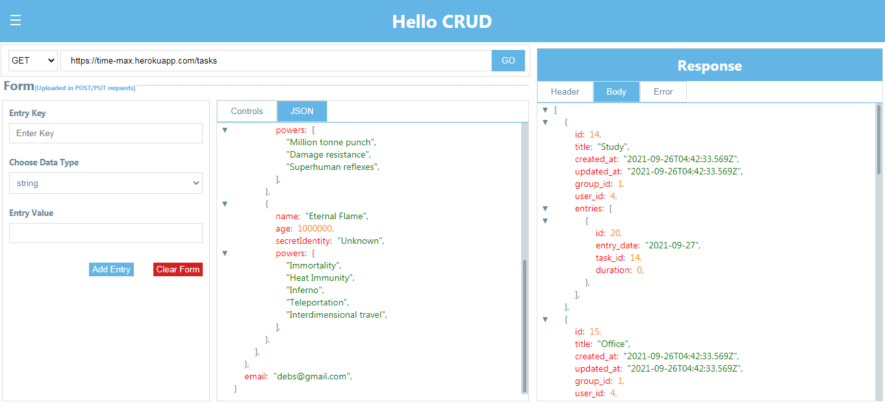

# CRUD

> CRUD is an API testing web application. It exposes all the CRUD request methods - get, post, update and delete. The request headers are also exposed, and users can edit them as they wish. All responses are in JSON format, and CRUD provides a nice JsonViewer to display the Response. The response header is also available in JSON format, so also is the error, if any. Developed with react and redux, CRUD provides a slim and user-friendly UI which makes it stand out from command-line tools that provide similar functionalities.



## Built With

- React
- Redux

## Getting Started

To get a local copy up and running follow these steps on the command line.

```bash

  # Clone the project from it's github repo.

  $ git clone https://github.com/chasscepts/crud

  # Change directory to the root of project

  $ cd crud

  # Install all dependencies

  $ npm install

  # Open app in your local browser

  $ npm run start

  # run all the tests

  $ npm run test

  # To build the project for production

  $ npm run build

```

## Authors

👤 **Obetta Francis**

[](https://github.com/chasscepts) [](https://twitter.com/chasscepts) [](https://www.linkedin.com/in/chasscepts/)

## 🤝 Contributing

Contributions, issues, and feature requests are welcome!

Feel free to check the [issues page](https://github.com/chasscepts/crud/issues).

## Show your support

Give a ⭐️ if you like this project!

## Acknowledgments
- Microverse Community
- Everyone whose code was used in this project

## 📝 License

This project is [MIT](./LICENSE)
